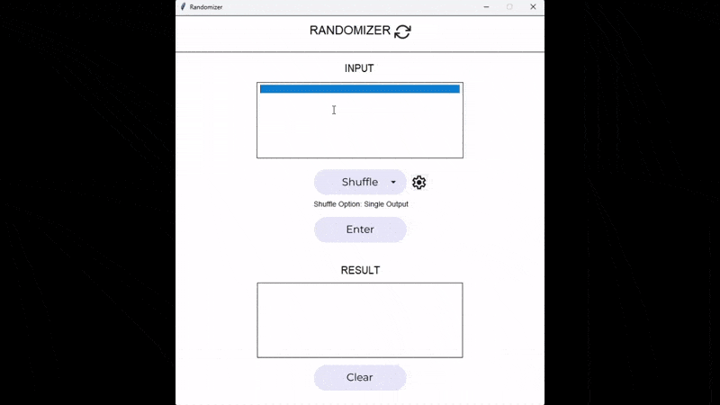

# Randomizer Application Documentation
    Note: If you want to clone this repository and run from your respective code editor or 
    IDE make sure you have installed the package first.
## 💻📦 How to install and run the Randomizer Package
  #### 1. Go to PyPi [Randomizer Package Link](https://pypi.org/project/randomizer-package/)
  ***
  #### 2. Go to terminal and run this command.
    pip install randomizer-package
  ***
  #### 3. Check if the randomizer-package is in the pip list by using this command.
    pip list
  ***
  #### 4. If a warning shows up that looks like this
  
  ***
  #### 4.1. Copy the directory showed in the warning and paste it into the PATH in the environment variables.
  
  ***
  #### 5. To run the package go to the terminal and run this command.
    run_randomizer

---

## 💁 UI Layout and Button Function Explanations
  #### Button Function Explanation
The **INPUT USER** field is designed for user input. 
***

When the **SHUFFLE BUTTON** is clicked, it will display a dropdown menu with several options. 

  * The Single Output option randomizes the order of the input. 

  * The Single Picker option picks one random output based on the input. 

  * The Multiple Output option displays multiple random outputs. 

  * The By Group Output option displays the output by groups, which the user will select according to the preferred number of outputs.
    
 ***
 **SETTING ICON**: Is for allowing duplicates in the
 variables or not
 ***
 
 **ENTER BUTTON**: will enter the variable inputted by
 the user and start the program
 
 ***
 **RESULT FIELD**: this is where the result will display
 ***
 
 **CLEAR BUTTON**: to clear the displayed output in the result
 field to be use again in the next task

  ***
  ## 💻 Application Demonstration
  
  ***

  ## 🛡️LICENSE
  Project is distributed under [MIT License](LICENSE)

 
  
